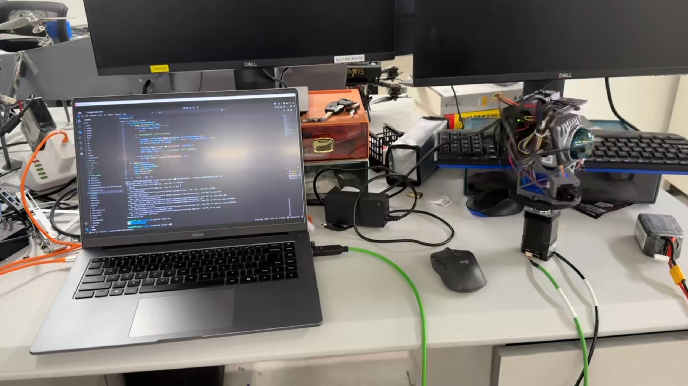
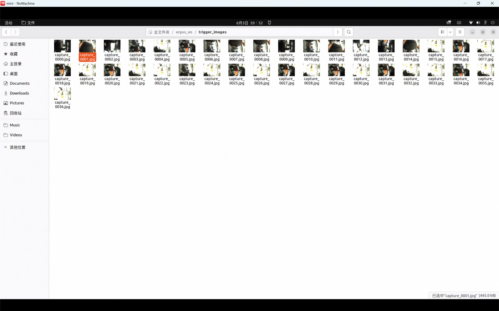

---

#  Argus: Intelligent Lidar-Camera Data Acquisition System

Argus 是一个专为自动驾驶与机器人视觉SLAM研发打造的感知系统。它不仅集成了激光雷达（Livox MID-360）与工业相机（海康威视）的实时建图能力，还内建了**基于里程计里程的角度触发抓拍机制**，极大简化了多传感器数据采集与标定数据的自动化获取流程。


##  触发机制原理 (How it Works)
系统通过订阅 FAST-LIO 的里程计话题 (`/Odometry`) 计算 Yaw 角变化。当检测到旋转增量达到设定值 (`trigger_interval_deg`) 时，触发标志位，并由图像回调函数 (`image_callback`) 截取当前帧，保存至本地路径，完美契合多传感器联合标定与三维重建的数据需求。

##  快速启动 (Quick Start)


1. **配置**:

    **电机/转盘**: [`BLM系列一体化无刷电机`](https://www.nimotion.cn/product/detail/17) 5mm法兰

    **雷达驱动**: [`livox_ros_driver2`](https://github.com/Livox-SDK/livox_ros_driver2) LAN1

    **相机驱动**: [`hikvision_ros2_driver`](https://github.com/SITU-YH/hikvision_driver_ros2.git) LAN2

    **FAST_LIO2 ROS2分支**: [`FAST_LIO2_ROS2`](https://github.com/hku-mars/FAST_LIO/tree/ROS2)


2. **安装**:
```bash
cd ~/your_ws_with_drivers/src
git clone https://github.com/SITU-YH/Argus.git
colcon build --packages-select argus --symlink-install
source install/setup.bash
```

3. **运行**:

修改`config/MID360_config.json`中的雷达ip`lidar_configs`以及主机ip`host_net_info`

修改`launch/mapping_trigger.launch.yaml`中的相机名称`camera_name`

修改`config/fast_lio_mid360.yaml`文件中的雷达-IMU外参矩阵`extrinsic_T`, `extrinsic_R` 


```bash
ros2 launch argus mapping_trigger.launch.py
```

系统将自动拉起雷达驱动、相机驱动、FAST-LIO 算法，并启动后台触发抓拍程序。




修改`launch/hik_camera.launch.yamll`中的相机参数
```bash
# 调整相机参数并同时在rviz中查看画面
ros2 run rqt_reconfigure rqt_reconfigure
```

##  参数自定义 (Customization)

若需要修改抓拍间隔，直接修改 `scripts/trigger.py` 内部参数：

```python
# 设置旋转触发阈值
self.trigger_interval_deg = 30.0 
```

##  开源协议 (License)

本项目遵循 [Apache-2.0 License](https://www.google.com/search?q=LICENSE) 开源协议，欢迎各位机器人领域的同行共同完善。


